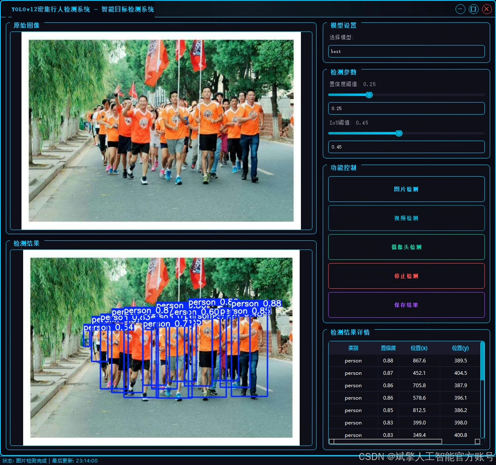
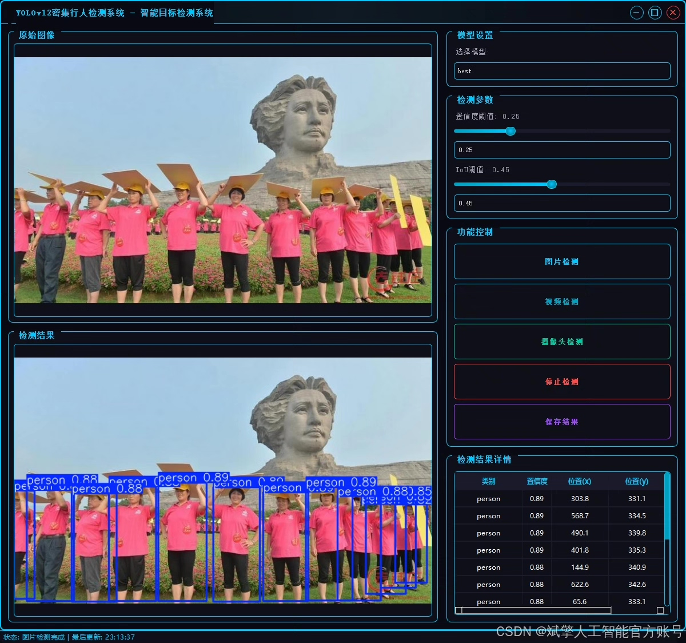
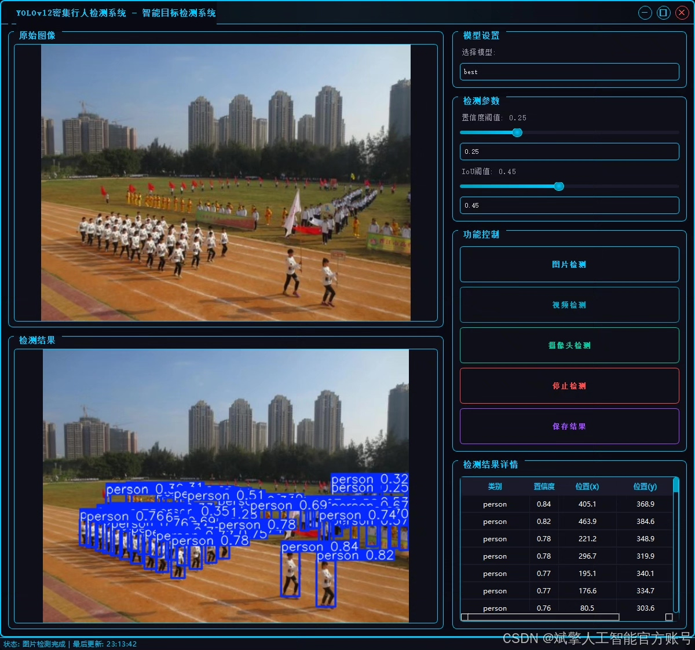
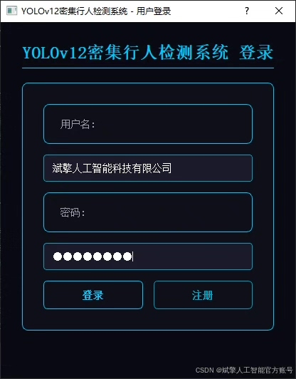
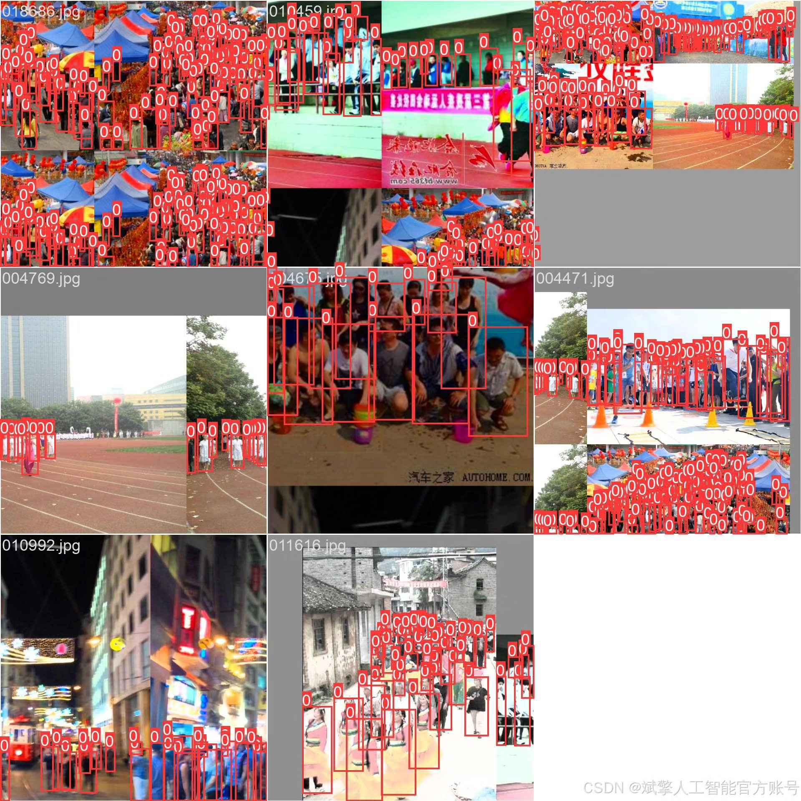
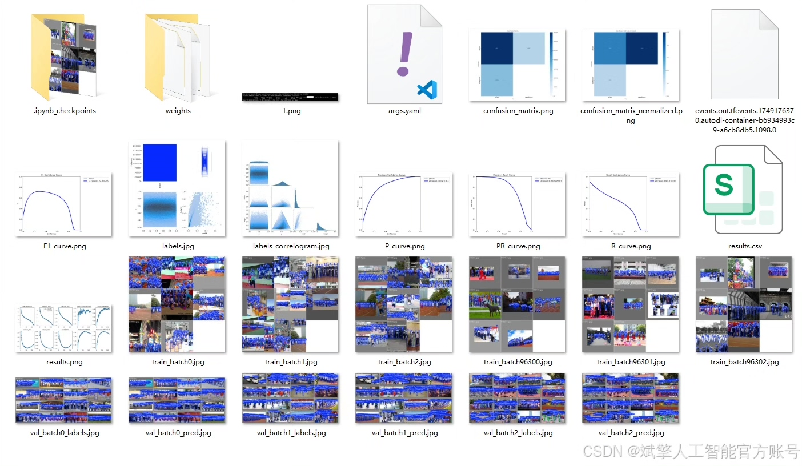
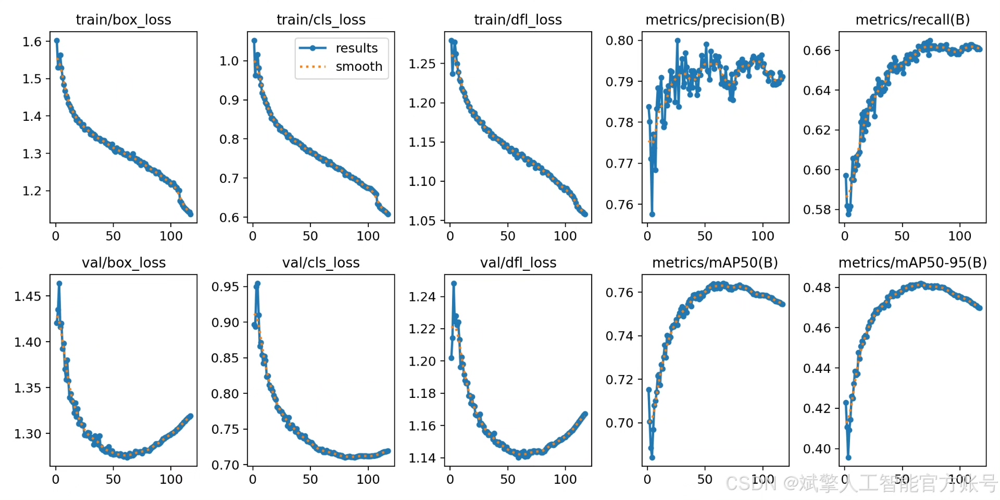
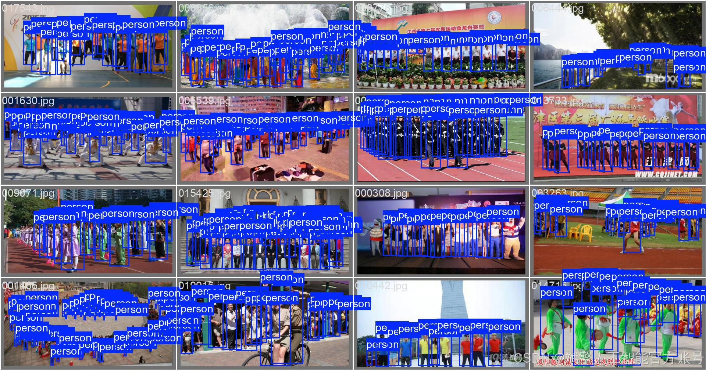

# YOLOv12 pedestrian recognition system

## Body

YOLOv12 pedestrian recognition system based on deep learning YOLOv12's dense pedestrian recognition detection system (YOLOv12+YOLO dataset + UI interface + login registration interface + Python project source code + model)

This paper designs and implements a dense pedestrian detection system based on the YOLOv12 deep learning model. It combines the YOLO dataset with a user-friendly UI interface to build a complete pedestrian detection solution. The system is developed using Python, including login and registration functions, and optimizes the detection accuracy and speed in dense scenes based on the YOLOv12 algorithm. The experimental data includes a training set (7200 images) and a validation set (1800 images).

✅ User Login and Registration: Supports password detection and security verification.
✅ Three detection modes: Based on the YOLOv12 model, supports image, video, and real-time camera detection, accurately identifying targets.
✅ Dual-screen comparison: Displays the original screen and detection results simultaneously.
✅ Data visualization: Real-time table displays the category, confidence, and coordinates of detected targets.
✅ Intelligent parameter adjustment: Offers a confidence slide bar to dynamically optimize detection accuracy, adapting to different scene requirements.
✅ Sci-fi style interface: Dark theme combined with dynamic light effects, reducing visual fatigue and enhancing operational experience.

## Images

## Payment

Here is a pay link on Stripe ( https://buy.stripe.com/3cs8yP7sY87d0vu9AB ). Please contact me lonlonago@foxmail.com after funding $89, and I will send you a complete data files , thank you!

